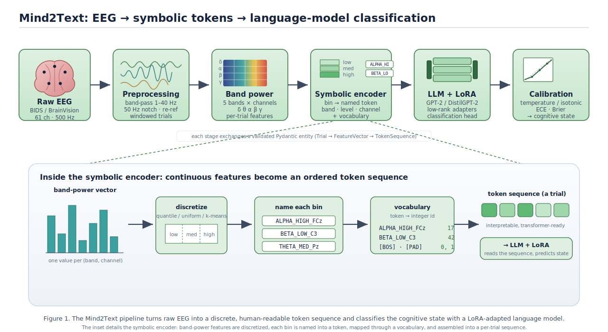

# Mind2Text: Symbolic Tokenization of EEG for Language-Model Classification

Mind2Text is a research framework that turns multi-channel EEG into discrete symbolic
token sequences, so that the representations and modelling tools built for language can
be applied to brain signals. The motivating question is simple: if a cognitive state
leaves a structured, band-resolved fingerprint across the scalp, can that fingerprint be
written down as a short "sentence" of tokens that a transformer reads the way it reads
text?

The framework covers the full pipeline: BIDS loading, signal preprocessing, band-power
feature extraction, feature discretization, symbolic encoding, vocabulary management, the
LLM classifier with LoRA fine-tuning, CNN and SVM baselines, and probability calibration,
all wired together by configuration-driven training and evaluation. Every stage exchanges
a validated Pydantic entity with the next, so the substrate for EEG-as-language
experiments is clean and typed end to end.

## Methodology

The pipeline converts a continuous EEG recording into a symbolic token sequence, then
hands that sequence to a sequence model. Each stage exchanges a validated Pydantic entity
with the next (`Trial` → `FeatureVector` → `TokenSequence`), so the data contract between
stages is explicit and checkable.



**Why symbolic tokens.** Band-power features are continuous and channel-indexed. Binning
each feature and naming the bin (e.g. `ALPHA_HIGH_FCz`) produces a discrete vocabulary
where each token is human-readable and ties a frequency band, an amplitude level, and a
scalp location together. A trial becomes an ordered sequence of such tokens, which is the
form a transformer expects and which keeps the representation interpretable at the token
level.

## Repository structure

```
mind2text/
├── entities/                 # Pydantic domain models (data contracts)
│   ├── common.py             # Subject, Trial, FeatureVector, TokenSequence
│   ├── dataset/  features/  modeling/  reports/
├── preprocessing/            # EEG loading and signal processing
│   ├── eeg_loader.py         # BIDS dataset loading (MNE-Python)
│   ├── signal_processor.py   # Filtering, notch, re-reference
│   ├── trial_segmenter.py    # Windowing into trials
│   └── feature_extractor.py  # Band-power feature extraction
├── algorithm/                # Symbolic encoding and tokenization
│   ├── binning.py            # Feature discretization
│   ├── symbolic_encoder.py   # Continuous features -> symbolic tokens
│   ├── tokenizer.py          # Vocabulary management, token -> ID
│   └── sequence_generator.py # Token sequence assembly
├── models/                   # Model implementations
│   ├── llm_classifier.py     # LLM classifier with LoRA fine-tuning
│   ├── baseline_models.py    # CNN and SVM baselines
│   └── trainer.py            # Training loop
├── postprocessing/
│   ├── calibrator.py         # Probability calibration
│   ├── evaluator.py          # Metrics
│   └── reporter.py           # Report generation
├── experiments/              # Config-driven training / eval scripts
├── configs/                  # Preset YAML configurations
├── examples/                 # basic_usage.py
└── docs/                     # datasets.md, training_guide.md
```

## Quick start

```bash
git clone <repository-url>
cd mind2text

python -m venv .venv
source .venv/bin/activate          # Windows: .venv\Scripts\activate

pip install -r requirements.txt
pip install -e .
```

### Dataset

Experiments target the OpenNeuro **ds004148** cognitive-task EEG dataset: 60 participants,
five conditions (working memory, mental arithmetic, music listening, eyes-open and
eyes-closed resting), 61-channel BrainVision at 500 Hz, organised in BIDS.

```bash
mkdir -p data/ds004148
# download ds004148 from OpenNeuro into this directory
```

### Running the pipeline

From loaded EEG to a vocabulary of symbolic tokens, ready for the classifier:

```python
from mind2text.preprocessing import EEGDataLoader, FeatureExtractor
from mind2text.algorithm import FeatureBinner, SymbolicEncoder, EEGTokenizer
from mind2text.models import LLMClassifier

# 1. Load EEG
loader = EEGDataLoader("data/ds004148", subject_ids=["sub-01", "sub-02"])
subjects = loader.load_subjects_metadata()

# 2. Extract band-power features
extractor = FeatureExtractor(sfreq=500.0)
feature_vectors = []
for subject in subjects:
    raw, events, trial = loader.load_subject_session_data(
        subject.subject_id, "session1", "memory"
    )
    fv_list, _ = extractor.extract_features_from_raw(raw, trial.trial_id)
    feature_vectors.extend(fv_list)

# 3. Discretize and encode into symbolic tokens
binner = FeatureBinner(n_bins=3, strategy="quantile")
binned = binner.fit_transform(feature_vectors)

encoder = SymbolicEncoder()
token_sequences = [
    encoder.encode_binned_features(b, fv.trial_id)
    for fv, b in zip(feature_vectors, binned)
]

# 4. Build a vocabulary over the token sequences
tokenizer = EEGTokenizer()
tokenizer.build_vocabulary(token_sequences)

# 5. Fine-tune the LLM classifier with LoRA
model = LLMClassifier(model_name="distilgpt2", n_classes=5, use_lora=True, lora_r=8)
model.fit(token_sequences, tokenizer)
```

## Design notes

### Typed data contracts

Every stage produces a Pydantic entity, so shapes and value ranges are validated where the
data is created rather than discovered downstream:

```python
from mind2text.entities import Trial

trial = Trial(
    trial_id="sub-01_ses-session1_task-memory",
    subject_id="sub-01",
    session_id="session1",
    task="memory",
    tmin=0.0, tmax=300.0, sfreq=500.0,
    channels=[{"name": "FCz", "index": 0}, {"name": "C3", "index": 12}],
    version="1.0",
)
```

### Preprocessing

Band-pass 1-40 Hz, 50 Hz notch for line noise, re-referencing, then segmentation into
overlapping windows. Band power is computed in five bands (delta 0.5-4, theta 4-8,
alpha 8-13, beta 13-30, gamma 30-50 Hz) per channel.

### Symbolic encoding and vocabulary

Each feature is binned (quantile, uniform, or k-means) and the bin is named into a token
that carries band, level, and channel. A vocabulary is built across the corpus of trials,
with optional special and prompt tokens for the downstream sequence model.

### Calibration

`postprocessing/calibrator.py` provides post-hoc probability calibration (temperature
scaling and isotonic regression) and calibration metrics (ECE, Brier, reliability
diagrams), so the classifier's confidence can be assessed rather than taken at face value.

## Roadmap

1. Cross-dataset and cross-subject generalization beyond ds004148.
2. Larger backbones (Llama-class) behind the same LoRA interface.
3. Generation: moving from classification toward token-level explanation of the neural
   patterns behind a prediction.

## References

**Datasets**

- Wang et al. (2022). *A test-retest resting and cognitive state EEG dataset.* OpenNeuro ds004148. DOI: 10.18112/openneuro.ds004148.v1.0.0. https://openneuro.org/datasets/ds004148
- Schalk, G., McFarland, D. J., Hinterberger, T., Birbaumer, N., Wolpaw, J. R. (2004). *BCI2000: A General-Purpose Brain-Computer Interface (BCI) System.* IEEE Transactions on Biomedical Engineering, 51(6), 1034-1043. PhysioNet EEG Motor Movement/Imagery Database (EEGMMIDB). https://physionet.org/content/eegmmidb/1.0.0/

**Tooling**

- MNE-Python — EEG processing and BIDS support.
- Hugging Face Transformers and PEFT — transformer models and LoRA fine-tuning.
- Pydantic — data validation and typed contracts.

## License

MIT — see [LICENSE](LICENSE).

## Contact

- Email: alikazemi@ieee.org
- GitHub: alikaz3mi
